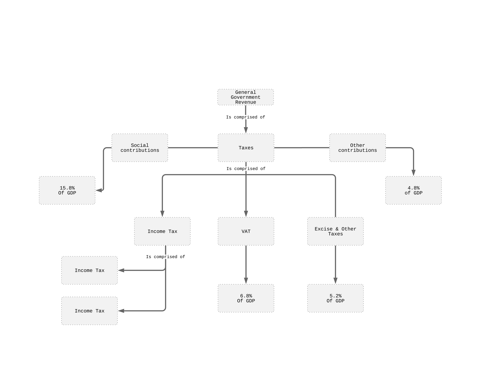

In a 2,500 words (+/- 10%) report describe and analyse the role of the public
sector in a chosen country. Conduct proper research and  The areas of interest
may include but are not limited to: the historic development of the public
sector, the size of the public sector, taxation, welfare provisions, the role of
state in the economy.

## Executive Summary

### Glossary
*The Political Economy*
: studies the relationships between individuals making up
the society of a state, the markets that are attributed and the state.

*The Public Sector*
: entails the general government and the central government,
as well as both function and responsibilities. Such functions include the
allocation, distribution and stabilisation of resources. These functions are
executed using support functions such as monetary / fiscal policies, public
spending such as welfare provisions / benefits or pensions. 

## Introduction 
The monarchic constitutional federation of Belgium, divides power between the
king as head of state and the prime minister as head of a multi-party
government. The government is threefold and equally powered in decision making
processes. The three language and region based communities have different
responsibilities to pursue. [@1] With a declining population of 11.2 millions
and same trend following GDP of 49,512 US$ per capita, Belgium is a
well-developed free market economy typical for its size and location within the
Euro-zone. There's 7.1% unemployment in the labour force, though Belgium has the
second highest social spending among the OECD countries and a total of 52.2% of
GDP general government spending. In fact, their high public spending is a
primary function they utilise to stimulate economic activity and provide
stability, as they did following the financial crisis in 2008. [@2] The
employment issues that may be seen in a relatively high unemployment rate in a
country the size of Belgium arise from not only economic factors and have much
to do with the cultural history and governmental role of Belgium. The role of
the public sector in Belgium is thus being analysed via the behaviour of the
state and their decisions upon public involvement, including taxation and public
spending.

## The role of the public sector in Belgium 
### A general overview of Belgium 
As mentioned, the role of the public sector is executed by the federal
government and supplemented by regional and culture (language)-based communities,
the king has its role being subtle and discreet relative to the execute powers
of the communities/regions. 

> Belgium is a federal state, composed of *communities* and *regions* 
> 
> The power to make decisions is no longer the exclusive preserve of the federal
> government and the federal parliament. The leadership of the country is now in
> the hands of various partners, who independently exercise their authority
> within their domains. [@3]

> The Federal government retains control over the judicial system, the army, the
> Federal police, labour law, social security (unemployment, pensions, health
> insurance), public debt, prices, income and wage policy financial sector and
> financial markets [@Economic_survey_of_Belgium_2017] 

The reason for this responsibility distribution is economic autonomy and
cultural considerations, which have emerged over the historic development of the
public sector of Belgium and their overall politics. Geographical regions can
adapt aspects relating to the economy, employment and public works depending on
the local economic activities, developments and political situation.[@4]
Cultural differences within the regions of Belgium are also reason for the
regions having emerged in the first place. Thus, *the communities* have
controlling powers over aspects including education, health policies or
assistance for individuals requiring assistance (social welfare).[@5]

> Presenting the survey in Brussels at a news conference alongside Belgian Prime
> Minister Charles Michel, OECD Secretary-General Angel Gurría said: “In a
> difficult global context, it is encouraging to see that Belgium’s economy is
> gathering speed, albeit at a modest pace compared to pre-crisis levels. There
> is much to be positive about, and Belgium possesses the necessary
> determination to address the significant challenges it continues to face. A
> focus on public investment and tax and education reforms are important actions
> in order to boost growth and make it more inclusive, so everyone benefits.”
> (OECD, 2017) [@6]

### Taxation Structure
*Tax-to-GDP* revenue in Belgium is 10% higher than the *OECD* average. In fact,
it is ranked third of all 36 *OECD* countries, just behind France & Denmark,
both central & northern European countries, less peripheral and closer to the
greatest economic activity & market, Germany. In comparison to other *OECD*
Countries, Belgium has greater revenues from taxes on "*personal income, profits
& gains; social security contributions; and property taxes*" and "*lower
proportion of revenues from taxes on corporate income & gains; value-added
taxes*" [@OECD_Taxation_Belgium]. In fact, the *estimated* percentage of GDP
for Belgium's total general government revenues is 50.7%. The composition of
that number and thus the sources of revenue streams for the Belgian Government
can be identified in *figure 1* below. 

Illustrated in *figure 1*, are the constituent contributors towards the taxation
revenue, knowing these is important when starting to think about public spending
and expenditure. Income distribution, wealth distribution and re-distribution
come into mind when considering from where and to where funds go within a
country, based upon public spending and taxation decisions. For *the people /
the citizens*, the structure is an indicator of the considerations the
government makes about the community (part of the population), that they
self-identify with. The reduction in corporate tax, with the aim to reach a 25%
corporate tax is an ongoing Trend, though Belgium's revenue as percentage of GDP
is greater than the OECD average, even Germany's. This trend may very well be a
result of globalisation, where *FDI* attraction is the objective behind
effectively lowering corporate tax, though the effectiveness of the overall tax
structure has to be secured, which is where concerns are raised. This
potentially problematic situation is an essential conflict of interest the
government has to balance using tools effecting the tax structure policies and
public spending behaviours. 

> In a free market where MNCs now hold greater negotiating power than many
> governments, the space for influencing international tax cooperation has been
> dominated by those with interests at odds with the general welfare.
> [@IMFCorporateTax]

With very similar personal income taxation to Germany, being closer to the OECD
average, Belgium is making up for its focus on collecting taxes from business
with lowered social contributions. The reduction in corporate taxes will need to
be adequately compensated for. One way Belgium is already doing so, is by
implementing a higher than usual property tax, which is far above Germany's and
too, above the OECD's average. The income (re-)distribution and wealth
(re-)distribution are two functions heavily affected by this property tax
decision, but are even more supported via the 0.15% *wealth tax* which Belgium
passed legislation for early 2018. [@KMPGWealthTax] A wealth tax is usually
perceived a distinct way by the public and specific communities and is a topic
of heavy debate as more EU countries consider and discuss such policies
regarding fairness and equality. The mentioned high public spending and the
destinations public spending funds arrive at support the public sector in
Belgium and strengthen its position within society, indicating Belgium's clear
interest and care for their political economy. The public opinion of the tax
structure impact the perception of the government and as such the involvement of
the state in the public sector. The relief of burden on individuals and the
reduction in taxes on corporations aids the public image and aligns with the
goals of the labor unions. [@OECDEconomicSurveyBelgium2017] The sources of
revenue for the government and thus public sector/spending are identified and
the interests of the government have become clearer from mentioned taxation
structure. The use of these funds identify the public spending. The general
welfare provision and involvement of the state within the economy and the
society are key to understanding the public sector and how it is perceived. 

### Public Involvement
Belgium's Public spending in areas such as education is more than 2% above the
average OECD country's GDP[@8]. *The communities* have executive power regarding
education related decisions and have to consider the three languages and
cultures represented within the country. Hence, the three autonomous educational
system in Belgium, *Flemish, French & German*, thus having issues managing a
fragmented decentralised education system, in terms of consistency of quality
and opportunities. Considering that the educational system experiences issues
with the threefold, decentralised communal system, it becomes clear that similar
issues may arise in the management of other departments of the public sector's
social welfare provision. Managing these issues correctly is apparently an
ongoing issue for Belgium, as public spending is described as "inefficient" in
the *Economic Survey of Belgium 2017 [@Economic_survey_of_Belgium_2017]*.

Belgium has the second highest social spending among the OECD countries [@9],
which aligns with the plans to stimulate economic activity and invest in social
public spending. Belgium, enabled through having such high social spending, has
the highest ranking *public unemployment spending* of any OECD country, in fact,
it is more than double the average OECD member country's [@10]. Not only does
Belgium spend a lot on unemployment benefits/compensations, but also on the
labour market in form of subsidies, training or direct job creation in the
public sector [@11]. Unemployment has been decreasing, while employment rate of
the total labour force has been steady [@IMF]. 

> The Michel government collapsed last December, after four years in power
> [@IMF2019ArticleIV]

Not only did he quit because of a UN mitigation pact, but also because of severe
difficulties with the social complexity and cultural community considerations
that have to be made, underlying the real difficulty of managing the
*threefoldness* of Belgium. [@TheGuardianBelgiumGovernmentCollapse] Labour
unions are agitated and have been for a while. These recent strikes /
interference from labour unions [@NYTimesBelgiumStrikes] resulted in a tighter
labour market and increased wages, seeing implementation in the new labour
market reforms and overhauled wage moderation.

> The government implemented a number of reforms designed to reduce unemployment
> traps, increase labor market participation, and introduce more flexibility in
> the labor market.[@IMF2019ArticleIV] 

*"The Tax Shift"* [@IMF2019ArticleIV] is another implementation Belgium made in
order to relieve the working individual.

> The Tax Shift (...) aims to improve competitiveness and strengthen purchasing
> power by shifting taxes away from labor. The reform, which was targeted
> especially to low wage earners, entails lowering social security contributions
> for employers and employees and reducing personal income taxes for employees.
> Partially compensating measures include higher excise duties on alcohol,
> tobacco, diesel (...) [@IMF2019ArticleIV]

Thus, price inflation will follow the rise in disposable income. High and
increasing public business investment spending is counteracting the tax vacuum.
[@7]

Belgium's employs a fully-funded statutory pension scheme, where 7.5% & 8.7% are
contributed by employee and employer respectively, but non-deducted from income.
Pension spending is similar to Germany and Spain in terms of percentage of GDP
spent. There’s a ¼ more pensions spending compared to the OECD average. In fact,
*"The projected substantial rise in pension expenditure over the long term is
one of the highest in Europe"* [@OECD_Pension_policy_notes_Belgium]. In 2017 it
has been recommended by the OECD to shift taxes away from the working individual
via corporate social security contributions. 

## Conclusion

    > Belgium performs well in many measures of well-being relative to most
    > other countries in the Better Life Index. Belgium ranks above the
    > average in work-life balance, income and wealth, civic engagement,
    > education and skills, subjective well-being, health status, social
    > connections, and personal security but below average in environmental
    > quality. These rankings are based on available selected data.  Money,
    > while it cannot buy happiness, is an important means to achieving
    > higher living standards. In Belgium, the average household
    > net-adjusted disposable income per capita is USD 29 968 a year, less
    > than the OECD average of USD 30 563 a year. There is a considerable
    > gap between the richest and poorest – the top 20% of the population
    > earn about four times as much as the bottom 20%. [^0]
    [OECD Country Fact Sheet Belgium 2015](https://www.oecd.org/gov/Belgium.pdf)

## References
