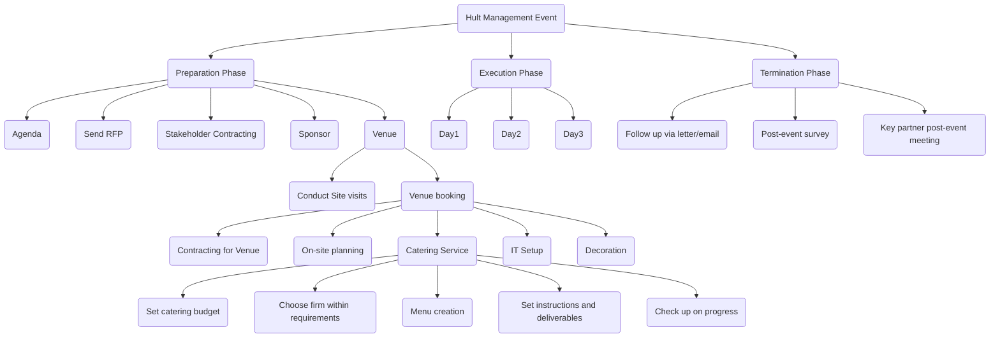

```mermaid
graph TD
A(Hult Management Event) --> 1(Preparation Phase)
1 --> 1.1(Agenda)
1 --> 1.2(Send RFP)
1 --> 1.3(Stakeholder Contracting)
1 --> 1.4(Sponsor)
1 --> 1.5(Venue)
1.5 --> 1.5.1(Conduct Site visits)
1.5 --> 1.5.2(Venue booking)
1.5.2 --> 1.5.2.1(Contracting for Venue)
1.5.2 --> 1.5.2.2(On-site planning)
1.5.2 --> 1.5Catering(Catering Service)
1.5Catering --> Catering1(Set catering budget)
1.5Catering --> Catering2(Choose firm within requirements)
1.5Catering --> Catering3(Menu creation)
1.5Catering --> Catering4(Set instructions and deliverables)
1.5Catering --> Catering5(Check up on progress)
1.5.2 --> 1.5.2.4(IT Setup)
1.5.2 --> 1.5.2.5(Decoration)
A --> 2(Execution Phase)
2 --> Day1(Day1)
2 --> Day2(Day2)
2 --> Day3(Day3)
A --> 3(Termination Phase)
3 --> 3.1(Follow up via letter/email)
3 --> 3.2(Post-event survey)
3 --> 3.3(Key partner post-event meeting)
```

