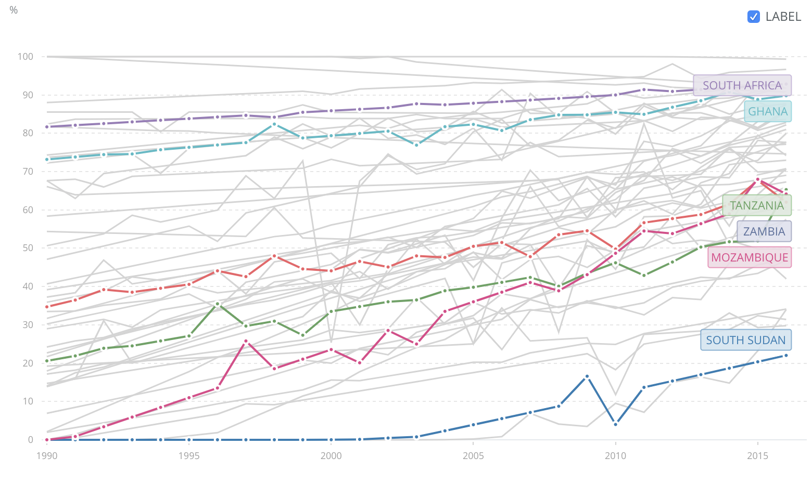
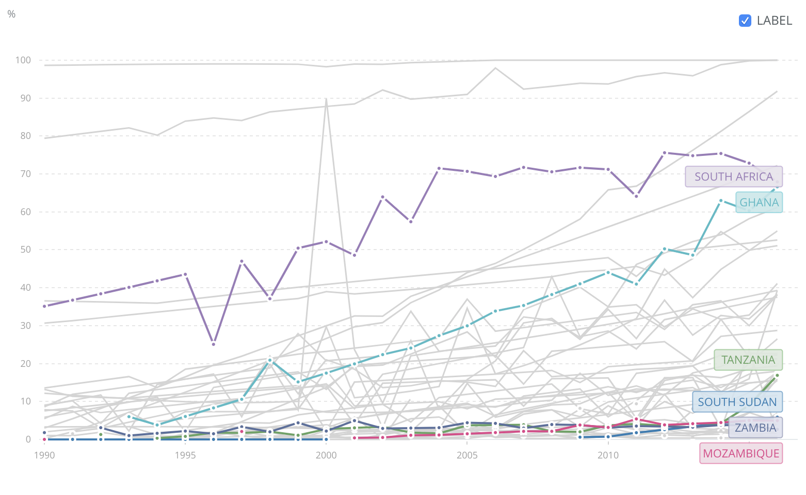

\pagebreak

## Problems and Pain

The Problem causing most of the pain identified is the lack of electricity in
rural areas of the Sub-Saharan Region. To just grasp how much of a problem the
lack of electricity is and how much pain it induces, one must consider those
involved (quantity), which in this case are many, and the pain induced in
qualitative terms. The two graphs below aim at visualising the severity of the
problem in terms of lives impacted. 

{width=50%} 
{width=50%}
\begin{figure}[!h]
\begin{subfigure}[t]{0.5\textwidth}
\caption{urban (\% of urban population)}
\end{subfigure}
\hfill
\begin{subfigure}[t]{0.5\textwidth}
\caption{rural (\% of rural population)}
\end{subfigure}
\caption{Access to electricity}
\end{figure}

When looking at the percentage of the population from urban and rural
communities and their access to electricity, incredibly low numbers are the
result for rural South-Saharan regions compared to urban communities in the same
region. The staggeringly low electricity access coverage becomes even clearer
when comparing to rural areas of central Europe, in which the electricity access
is so well established as a standard, that it isn't worth considering urban
areas, which nearly everywhere reach 100% of the population. 

The root cause of having no electricity or water in rural areas causes much pain
in many stakeholders associated with the entity in question. Such stakeholders
are companies missing out on massive commercial opportunities in the Sub-Saharan
region due to the nonexistence of these utilities, those of the many rural
community citizens, the governments struggling with changing the circumstances
and so many more. 
For ease of understanding, it is better to view the pains in separate planes, so
that there is the one of those living in said rural communities and the one of
those wishing for those communities to develop. 

### Pains of rural communities and their members

There exist many pains on many different levels within Rural Communities. To
effectively grasp the many different pains, it is advised to consider
multi-perspective viewpoints, including the perceptions of different entities
regarding one or multiple aspects of a situation.

*Characteristic pain* 
: which is experienced by a particular individual because of his/hers
individuality in characteristics - such can be children or teachers who
experience pain in a situation that is uncommon to any individual not having
characteristics that lead them to be in said situation. 

*Communal Pain* 
: which is induced only when multi-characteristic individuals aggregate and
arises because of individual pain not equaling communal pain.  Individual pain
can also be extrapolated by the existence of communal pain - such can be
families or communities as a whole where a common pain point can experience
the emergence of a new pain, additional to the aggregated common pain, due to
the accumulation of said common pain. 

**The pains include:**

Types of Pain                                                       | Pain Owner
--------------                                                      | ---------------
So many pains cascading from the lack of electricity/water supply   | Families, individuals, communities
Can't use productivity enhancing technology                         | Labour-force, families, students, communities
Don't have the privilege of electrical home appliances              | families
Can't easily research                                               | students, pupils, the curious
Can't communicate with my family members                            | Family members
Can't stay up-to-date with what's going on nearby or afar           | Families, individuals
Can't call an ambulance/help/police if necessary (if even existing) | Families, individuals, communities
Can't simply buy fresh or non-local food                            | Families
Can't keep food fresh/edible for long in the heat                   | Families
Boredom Roams much of the day                                       | Individuals
Can't research/learn                                                | Children, teens, curious individuals
Can't buy many things I would like to                               | Families, individual members of rural communities
Can't expect things to become better without things changing        | Communities
Can't *automate* recurring tasks                                    | Families, Labour-force, communities
At day, there's no AC, at night, there's no alternative to fire     | Families, communities
A lot of disease/hustle/pain due to *below-standards* sanitation    | Communities
There's no option for engaging/receiving in politics                | Communities, individuals
Safety drops and boredom peaks after sunset                         | Families, individuals
After sunset, there's so much that can't be done without light      | Labour-force, families, individuals, communities

Many of these pains have similar roots, which mostly relate to each other in
some way, those *crystallising* in essence are, that there is no commercial
availability to buy many things that many would like or that there is no way of
communication.

Thus, the root causes of those *pain points* are similar as well, coming down to
the lack of electricity and water and the missing funds for communities to
locally influence the landscape - missing infrastructure can be included in
missing funds, considering the option traditional infrastructure alternatives.

> *Insert "As is, as needed to be, to be" here*

> **Sample Scenario**
> Mobile phones have immense positive potential in terms of impact on rural
> communities, ranging from enabling communication, which impacts so many areas,
> like healthcare, emergency alert, education, policing, safety, family
> management, shopping, community coordination... 
> The absence of a mobile network boils down to the *classic "Chicken & Egg"*
> dilemma, where mobile network infrastructure won't be built by commercial or
> public entities until there's no demand for such an expensive undertaking. If
> the construction were simpler and cheaper, it would be done - thus, the
> existence of projects like [*Starlink*](https://bit.ly/2KDGats) that aim at
> providing-low cost global broadband satellite-to-consumer technology. Though,
> still there are no mobile phones and there won't be until they can be
> recurrently and preferably sustainably recharged, which requires one essential
> commodity, electricity.

### Pains of those wishing for those communities to develop. 

Those wishing for rural communities to develop (also, but not only
economically), include the neighboring and regional communities, the government
governing these communities, NGO's providing aid, other countries providing aid,
commercial firms wishing to generate sales from rural communities, more urban
environments wishing more capacity/capability - requiring resources, including
rural community members.

**Types of Pain**                                                                | **Pain Owner**
--------------                                                                   | ---------------
Can't sell my traditional product to potential customers                         | Domestic, international businesses
Can't get my cheap, alternative product to those communities                     | Domestic, international businesses
Can't reach my population for political reasons                                  | Government
Can't utilise domestic labour-force without necessary infrastructure investments | Domestic, international businesses
Can't offer my (charity) services due to missing communication possibilities     | NGO's, businesses, charities

These entities have different pains than the rural communities and their
constituent members, but again boil down to similar root-causes, missing
electricity, infrastructure and economy.
*A business cannot sell its products to those communities without any
possibility of effectively communicating with them.*
From this point of view, it seems as though the introduction of electricity
isn't all the pain's root cause, but may be diminishing/hindering development in
the root cause identified, including infrastructure.

> *Insert "As is, as needed to be, to be" here*

-------------------------------------------------------------------------------------------------------

> *"Most Pains and their root causes are interwoven in a complex network of
> causality, similar to a poverty-cycle."*

And thus identifying and agreeing on the root-cause for the problem to solve is
the first step of fixing it.

## A typical Scenario

**South-Sudan**

Imagine a day in the life of the citizen of a small village community, of not
even 50 people, in a Sub-Saharan Country like South Sudan.
There is no supermarket, no internet, no running water nor electricity, no way
to order anything quickly, but every trip to the closest bigger community for
any type of resources/products requires planning and much time in execution -
not an easy task.

> *"South Sudan has only 5.1% of its population enjoying access to electricity.
> It has less than 1% of its roads being paved ones, and less than 1% of the
> population have formal, Western-style housing as we would recognize it as
> well. Such a want for facilities has been the result of 30 years of war and
> government neglect. The government is now trying to attract foreign investors
> to conduct their varied business ventures within South Sudan. Many of these
> will be for power generation and distribution, transportation infrastructure,
> and property development."* ([Comparison of access to electricity in African
> Countries](http://bit.ly/2WmlMPH))

------------------------------------------------------------------------------

The community is unable to provide electricity to its citizen - That includes
light after sunset, heating/cooling of housing in the at day incredibly hot and
during night moderately cool biome. They cannot run appliances such as
refrigerators, whose absence accounts for much of the already few existing food
going to waste. After all, a fish laying around in this region for longer
than any given period of time will start to become unenjoyable.

> In developing regions, often the biggest chunk of food loss occurs during the
> post-harvest phase But in developed regions, the biggest chunk occurs at the
> retail and consumer  levels. (Food & Waste Organisation of the United Nations)

In addition to not being able to keep food stored for long, electric
ovens/microwaves/stoves are also missing out and instead used are traditional
wood burning or fewer seen gas appliances for cooking.

No electricity means no means to charge any electric device or even use any non
*"accumulator/battery"* powered electric device. That means no mobile phones, no
radio, no television, no communication method with family members or friends.
There is no way to learn anything new other than books and stories. No way to
exchange ideas, collaborate - everything seems disconnected. That is in fact
the second factor to focus on as disconnectedness is a consequence of the lack
of electricity as there's no digital network nor any effective/efficient enough
non-digital network and causes many of the other pains mentioned above. Note,
that connection can also include physical connection in terms of logistics, thus
also addressing the infrastructure problem.

*A teacher* cannot pull up a video on *youtube* to further explain his point,
communicate with students in any other way than them being in the room, require
his students to be able to do extensive research and so many more things,
knowing that he is most likely to only source of knowledge available. His
ability to pursue what he desires and enjoys doing is limited by the
non-existence of electricity and the lack of the consequences following
electrification. 

> Besides requiring energy access being crucial for many basic human needs, the
> underserved populations represent a massive commercial opportunity for
> sub-Saharan African utilities. Advances in distributed renewable energy
> technologies have made utility providing units more affordable, faster to deploy
> and more transparently/stable. 
> [Millions of urban Africans still don't have electricity: here's what can be
> done](https://bit.ly/2ZfNe3v)

Considering the percentage of individuals and communities living
*under-the-grid* in many rural Sub-Saharan African regions, it seems like there
is much potential for the offering of a electricity providing utility service.

## Solution Proposal to Problems and Pain

The proposed solution to the cascading problems and pains created by the
root-causes is a self-contained, expandable electricity provision and storage
unit. This storage unit works by utilising *hydrogen* and solar technologies for
energy production and storage. 

### The Hydrogen-Solar cycle

1. Use electricity generated from solar panel to split *water* into *hydrogen*
   and *oxygen* gas. The oxygen gas can be release into the atmosphere.
   - The splitting step requires energy, thus the necessity of the solar panel. 
   - This whole step should be done close-by water sources or oceans, they
     require water to split.
2. Get the hydrogen gas to rural communities.
   - The hydrogen gas is super-light and not expensive to store/transport
   - It is less flammable than car-petrol
3. At the rural community, combine the hydrogen gas with oxygen gas (extracted from
   the atmosphere) to generate electricity and have water as a side-product.
   - The combination of the two gases happens naturally when in proximity, as
     oxygen is hydrophyllic. 
   - The combination of hydrogen and oxygen releases energy for immediate use or
     storage in buffer batteries.

The concept proposes to use hydrogen as a medium- to long-term energy storage
method. For e.g. night-times in which the solar panels don't work, batteries are
sufficient, but are expensive and not environmentally friendly in production.
Batteries also degrade and are definitely not the sole solution  for a
medium-term energy storage on community scale. Hydrogen is the *marathon runner*
amongst energy storage/release methods. Batteries are more like a 500m sprinter
and capacitors are the 100m sprinters. Given that most loads in these rural
areas would be relatively *unintensive*, leaves as a good option to choose a
hydrogen/battery hybrid system. 

The system has to be able to easily withstand heavier loads of energy demand but
also be stable enough and should utilise energy storage methods that have
longevity in mind. Considering that maintenance et cetera will be harder than in
urban areas of the developed world, these systems should be as self-contained,
independent and sustainable as possible.

### Effectively reducing pain through the root-cause targeted solution

> *Insert "How the proposed solution effectively minders pain by tackling the
> root-causes" here*

> *So far, I haven't included the graphs from the excel table, as they are in
> the last Submitted Assignment and I will change them to be more precise to
> these assumptions.*

--------------------------------------------------------------------------------

### References

Water access (may be more important than electricity for sub-Saharan Africa.
(2018). The Conversation. Retrieved 11 June 2019, from
[here](http://bit.ly/31ABlHs)

FAO (2019). Fao.org. Retrieved 11 June 2019, from
[here](http://bit.ly/2ZkcZj0)

> World Bank, Sustainable Energy for All ( SE4ALL ) database from the SE4ALL
> Global Tracking Framework led jointly by the World Bank, International Energy
> Agency, and the Energy Sector Management Assistance Program.

Access to electricity, rural (% of rural population) | Data. (2019).
Data.worldbank.org. Retrieved 12 June 2019, from [here](http://bit.ly/2ZfY9tU)

Access to electricity, urban (% of urban population) | Data. (2019).
Data.worldbank.org. Retrieved 12 June 2019, from [here](http://bit.ly/31s02pb)

------------

## Notes

Value comes like waves at the beach, the pain relief is the retreat of the
wave, which causes value to take its place.

