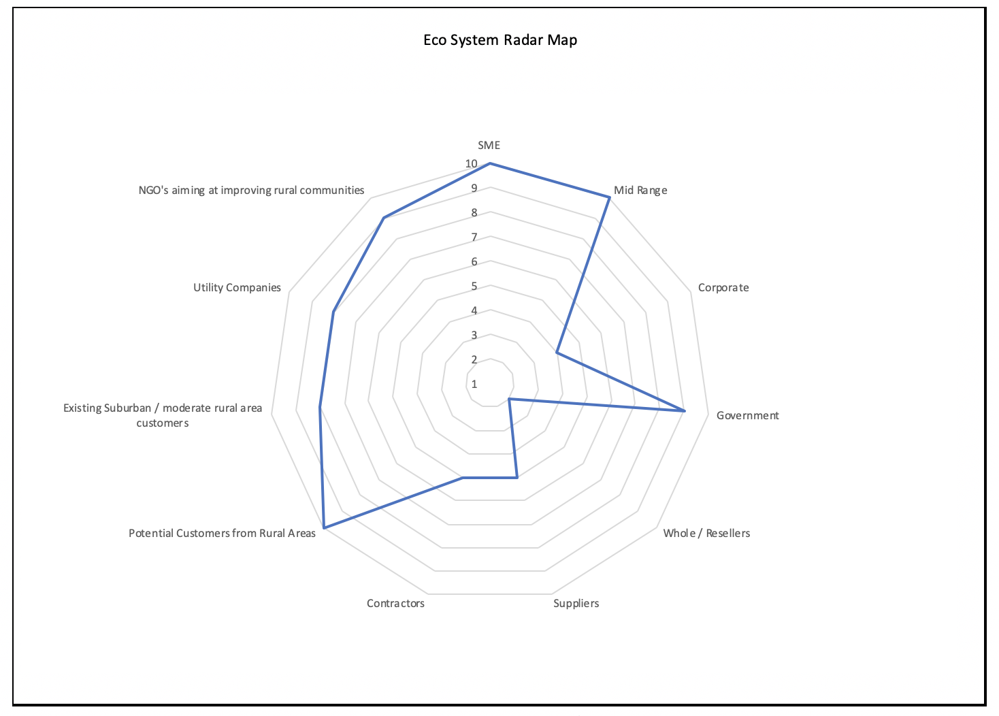
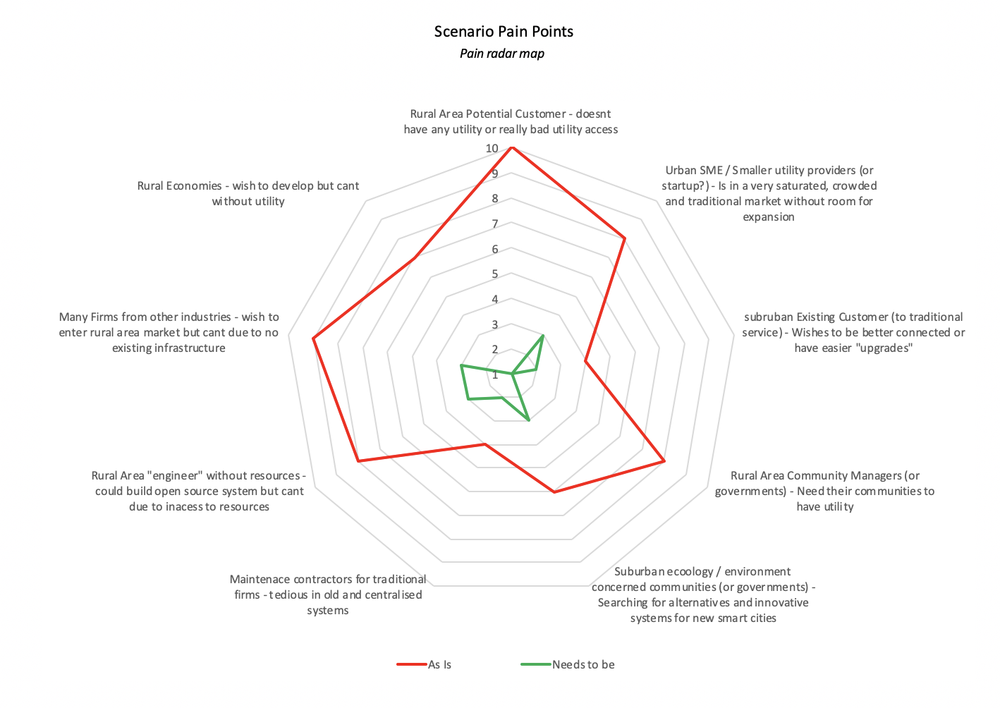

> The concept itself is applicable for many industries/sectors/firms. The
> example of water/electricity provision utilising hydrogen technologies is
> solely for imaginative purposes and to visualise the fact that most of the
> problems have two-sides to consider in terms of *pain and relief*. A just as
> much adequate example could be the provision of internet access (or P2P local
> area networks), exotic food diversity using direct transactions as well as
> micro-transaction & micro-services to boost local economic development.

## Entering rural area markets to improve communities

Rural areas in developing economies have a common *chicken-egg-dilemma*, in
which there is hesitation of investment, especially such as electricity-
/water-infrastructure grids. Many traditional supply chain mechanisms start to
break down outside the developed, well connected urbanity of cities. The
resulting *pain* for those not having access to many living standard raising
products/services/utilities is immense and is wedging societies into polarised
extrema of wealth. On the other hand, urban areas experience intense pressure of
dense competition, leaving many firms unable to expand or even sustain. The
proposed solution for both sides is *entering rural area markets using
decentralised, blockchain governed, hydrogen powered utility systems*.

The realisation would be represented as an independent, self-contained,
sustainable unit that provides electricity/water for a whole house/community.
It's modular design allows expansion and easy setup for scale. It being
contained allows for a decentralised network of utility provision made of
self-sustaining nodes. A *Blockchain* would govern demand and supply as well as
logistics via consensus. It would utilise smart contracts to balance surplus and
shortages of utility and consensus for priority requiring situations.

In practice that could be achieved by a combination of solar power generation,
short time battery storage, electrolysis/hydrolysis machines and long-term
energy storage using hydrogen. Such systems could then be *leased* to
communities to independently produce water and electricity. The resulting
opportunities for economy, already starting at installation and maintenance of
these systems alone, will enable those communities to repay the lease *"À la
grâce d'effet du multiplier"*. 

By using hydrogen as a long-term energy storage, shortages and surpluses
can be balanced out by transporting said gas capsules to nearby nodes. This
system not only generates electricity and water, but also fuel, which can be
used for logistics sustainably and eco-friendly, without any exhaust gases and
is cost efficient considering hydrogen's weight.

For a company experiencing *pain* in form of pressure from fear regarding
revenue, potential of expansion, innovation or competition the change will
affect different entities on different levels accordingly. Senior management
will be mostly worried about market saturation, competition and potential
blue-ocean industries or geographical areas for market entrance and will thus
feel the most pressure to change. The trickle down effect will induce pain
throughout the different other levels of the organisation caused by the implied
e.g. *job-security prospect* based on decreasing economic performance.
Operational staff will experience the most drastic change, while only
experiencing mediocre pain, but there are long-term effects on their well-being
counteracting short-term change resistance, e.g. *job-security & potential for
career opportunities* based on innovation brought by the solution.
Many firms have potential in concepts such as this, not only as direct
competition, but also as contractors, suppliers, educators et cetera.
Abstraction can be done to employ a similar concepts on a different industry,
such as the decentralisation of food production using *vertical hydroponics* or
*IOT* devices automating/relaying/performing specific tasks to form a P2P mesh
network. 

Thinking about the capabilities of *W3 & blockchain* and completing the *"Can it
work?"* template, one comes to have good concrete ideas of how to implement a
*good idea*. 

> *Attached are the findings of the "can it work?" template, containing more
> details regarding the realisation and w3/blockchain capabilities of the
> system.* 

