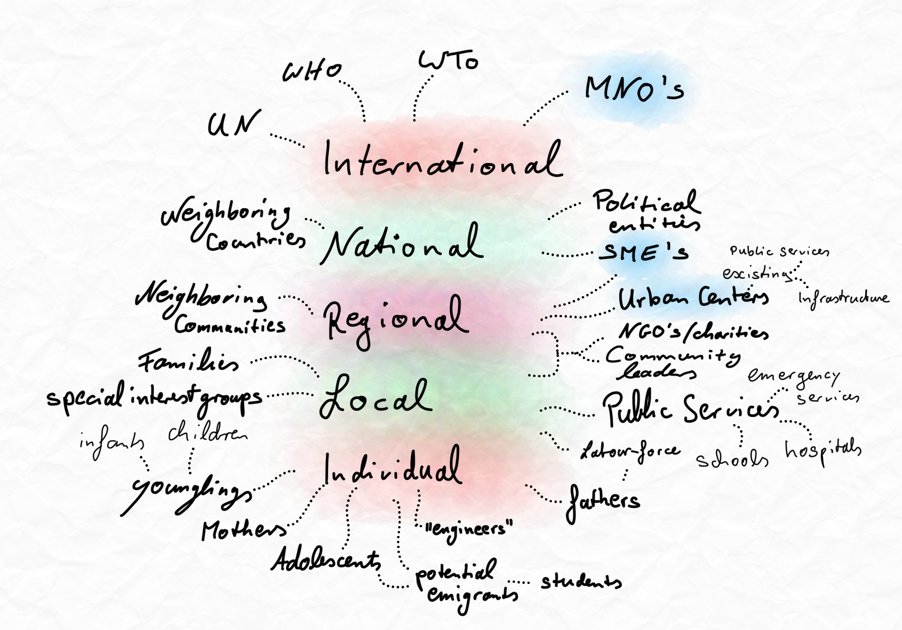

\pagebreak

> This part focuses on the value proposition and refers to prior identified pain
> points. 

The multilateral presence of the identified problem urges the separation of reasons
for adoption relevant and specific to each pain experiencing entity. The
adoption as a whole is reliant on a critical adoption mass, which consist of
mentioned constituent entities. The nature of cascading pain requires that
individual value propositions are constructed so that the adoption, of the
concept as a whole, commences as the adoption of a good idea for each entity.  

It should be clear, that for those, which are sought for investment purposes,
have a very different assumption of value, than those that the project aims to
support, due the social enterprise nature of the project.

The cascading pain requires cascading solutions, delivering value. The aggregated
values are hypothesised to have a greater value as a whole than the sum of the
constituent values to each entity. The Synergistic nature of the method used in
the process of value capture should enable and support the hypothesis.
Value, itself, in this context refers to the difference between the instances in
which the pain exists and in which the pain has been reduced and thus
the circumstances of hindrance transformed into productivity.

## Identified Entities 

Below is a visual representation of the different levels on which entities that
experience direct or cascading pain lie. Shaded in blue are those, that have
residual interest in the (economic) progression of such areas/communities in
question (e.g. SME's that would like to engage in trade with local communities). 
Those higher-level entities are always made up of individuals, which have
individual pains, while collective pains add to those. 

A clear example would be, how families suffer as a whole through collective
pain, like the inability to have family events or stay in contact with each
other when geographically separated, while individual pains add to the overall
level by pains like stress, which originate individually. Another example could
be how neighboring communities, that are more urban and developed, would like to
engage in trade and individuals from those communities, who may have family in
more rural communities, experiencing disconnectedness from distance.

Collective pains, such as the consequences of missing utility infrastructure,
spread throughout the levels while individual pains, such as the inability to
perform any productive task after dusk, are level specific.
Thus, as one moves closer to the entities experiencing individual pain points, instead
of *collective pain*, one can see how the specificity of the problems increases
and thus the specificity of the value proposition in terms of the idea of pain
relief.

## Value proposition & individual *"good ideas"*

The *good ideas* and the from them emerging value should be treated
level-specific. The value of the good idea may very well be appealing to
multiple entities and may be *overarching*. This phenomenon of *overarching*
originates from overarching principles, values held close by entities. The good
idea itself can create *consequencing* good ideas, which add value to the to be
captured value of the high-level good idea.

### International level

On the international level, a good idea would constitute to the goals of
international entities, like the WTO or MNO's, who are interested in the
economic progression. A *good idea* could be the political and/or financial
endorsement of the project as a whole. The potential of the introduction of the
project has much greater potential in terms of impact at a higher level than on
a lower level, considering how the lower level potentials are aggregated in
higher levels. Not only do they aggregate, but also synergistically more
abstract and different potential values emerge. An example of this is how on an
individual level, the further away consequences are much more abstract and
intangible compared to a higher level entity's point of view. A south-Sudanian
mother would probably not see how this project could result in the possibility
of *product delivery*, compared to a constituent of a political party, aiming at
the introduction of a wide-spread product delivery system for the whole of the
country.

### National level

Similarly, the common goal of those entities identified in this level is the
progression and the thus resulting potential value. Political entities could
include a significant missing piece of the population into political decisions,
instead of solely having the opinion and democratic input of urban areas.
Especially relevant at this level and the following regional level are the small
to medium size enterprises. Those have a lot of positive power to be engaged,
not only in economic terms, but also in the adoption of the project. Their
expansion into more rural areas is likely even without this project, but would
greatly increase the progression and penetration into more and more rural areas.
Considering that the project would unlikely commence in the most extreme rural
areas, the relative urban nature of those communities that will have the
hydrogen system first, is accompanied by relative higher disposable income,
which is the reason for SME's to progress into rural areas. The interest of the
project and the interest of SME's (or MNO'S) align and mutually complement each
other in terms of needs to be covered prior to the actual localisation in rural
areas, which is electricity.

### Regional level

On a regional level there are more specific *good ideas*, not only support but
more specific action can be taken. The problem itself becomes more tangible and
specific at this level. The cascading pain becomes more similar and similar, the
closer to the individual level and thus the identification with the problem
itself. Many entities on the regional level also exist in some form on the local
level, like charities that aim at delivering hands-on aid. Such hands-on aid
could come, specific to this project, in the form of educational programs, which
can be paired with the education required for the continuous operation of the
hydrogen energy storage systems, like maintenance or the identification of
problems with the system. Community leaders are present at a communal level, as
well as on a regional level. These *elders* / head of communities have the same
problems and pain experience but can deliver very distinct individual support.
*A good idea* to adapt could be the public endorsement within the communities
and spark of interest for programs brought by said charities. Other than that,
they would be the first concrete point of contact for the installation of the
hydrogen systems and are therefore vital cooperators. When considering cascading
potential value one sees, that  the widespread adoption of digital technologies
will be slow, due to the critical mass required for adoption, centralised
approaches can be used to increase adoption rate. A specific example could be
the installation of a commonly owned and operated connected device. Such could
come in the form of a internet connected or knowledge filled computer (could
also be used as a centralised bulletin board) located in regional *relative
urban* centers to be accessed by surrounding local communities. In the
beginning, communally accessed computer systems function the same as communally
accessed energy storage systems. Not every single individual requires
possession for this (or any) project to be adopted or to progress effectively.

The adoption of the hydrogen system will as the above mentioned introduction of
digital technology be slow. Again, regional centers could be the pioneering
entities to implement the system, demonstrating its usefulness to more local
level entities, who may not see the direct connection between the system and the
from it originating potential value. A regionally centralised hydrogen system would be
bigger than those in local levels, but simultaneously would have more force
behind its support or restraint. **Tokenisation** should be at the core of the
project, allowing communities to own their energy systems partially and thus
control it. A PAYG (pay as you go) financing system coupled with leasing,
through aggregation (communal ownership) would be a very good idea for this
systems adoption.  

Smart contracts can be used to balance the electric load indifferences between
local communities. A shortage of electricity in one local village could be
covered by a surplus in another village in proximity or a more urban community
with greater energy production/storage abilities. The automatisation of such
processes reliefs much labour from individuals and addresses one of the
potential arising problems from the project, as every *good idea* and project
will not only have positive outcomes, but also additional considerations to be
made.

### Local level

The closest to the individual level, the entities here are easiest for the
identification of individuals within. Families are made up of very easy to
identify individuals. At this point, we also have those entities that deliver
any kind of service/value directly to individuals and thus their relation and
mutual benefit is clearer as in higher-levels. The labour force of villages
would be very much interested in the increase in productivity levels, which can
be clearly communicated in specific changes that enable such increase. The
introduction of electricity opens many productivity enhancing aspects and the
benefits from the project as a whole are clear to an entity like the workforce
in this context. Public services in the regions in question are much less
effective and efficient than in urban areas, due to the tools and potential
possible to use. Their aspiration towards becoming more like their more urban
counterparts will support the adoption of the project and at this point the
overlapping of values and interests becomes clear.

### Individual level

Mothers, *younglings*, adolescents, students, potential emigrants are dominant
entities to consider, as they are the constituent elements that make up higher
level entities. These constituent entities have the most specific value
propositions and henceforth the highest amount of potential value to be
captured. In comparison to the international level, the pure count of values to
be captured is much greater, due to the cascading effect of the root-cause and
thus cascading potential. A potential emigrating *tech savvy* student/adolescent
would adopt a *good idea* of maintaining the hydrogen systems as it would be a
reason not to emigrate, by brining most reasons for emigration with it in form
of consequences (cascading potential value). The project as a whole would
provide electricity, which would ultimately enable the introduction of digital
communication and research tools enabling local education and progression.
A lot of the value comes in the form of time savings, that are created by
inefficiencies. Such inefficiencies could be need of having to purchase food
much more frequent due to the lack of refrigeration or the need of having to
cook every day instead of preparing meals. The introduction of *online-shopping*
in African countries has already happened, in urban areas, rural areas could
also be expanded to, as soon as the ability for those individuals in rural
communities happens, to order online *at all*. Such undertaking requires access
to online markets, which requires digital *portals* like phones, which require
electricity to be continuously charged. A practical example is **Jumia**, a
local online market enterprise. Jumia could then sell items like diapers to
mothers, which would normally walk long distances (due to missing
infrastructure) to more urban centers in which goods like these can be bought. 
The potential for individuals to use *Jumia* is immense and is a clear cascading
potential value to be captured. Many individuals may not see the direct link
between the project, the *good idea* and the from it coming value. Thus,
higher-level entities, who have more aggregated considerative/brain-power, are
those to *explain* / bring closer the potential of the idea to individuals. From
this consideration it can be seen how the introduction of the idea could have
self-expanding interest/support. The value identified in higher-levels will
cascade down to lower-levels. The cascading effect is not only a direct
transportation of the idea and potential value, but is also similar to the
*leverage effect* the closer to the individual, as more specific potential value
can be captured there.

## Conclusion

Commencement and continuous implementation of this project and/or related or
cascading values can only occur when a multilateral consensus on the adoption of
the project is reached. Individuals, entities that are made up of them, as well
as communities, interest groups up to governments need to be united in terms of
wanting the project to be adopted. To enable such behaviour, the value that is
gained from the implementation of this project needs to be clearly communicated
to each entity. To do so, it has been concluded, that multilateral value
propositions need to be created addressing each entities pain points. Only then,
a project, as great as it is, will be adopted without restrain and resistive
forces. Especially in polarised circumstances, as they are in sub-Saharan
countries, the unification of adoption or the lack there of can mean fail or
success. 

------------------------

\pagebreak

## References

Jumia Group | Jumia Expand Your Horizons. (2019). Jumia Group | Jumia Expand
Your Horizons. Retrieved 29 June 2019, from https://group.jumia.com/

User, S. (2019). South Cluster - Computers For Africa. Southcluster.org.
Retrieved 30 June 2019, from http://southcluster.org/our-project
