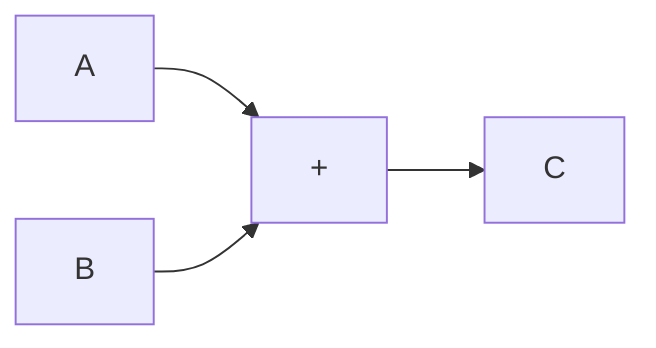

## Favorite Resources

[Siamese Neural Networks and Face detection](https://towardsdatascience.com/how-i-implemented-iphone-xs-faceid-using-deep-learning-in-python-d5dbaa128e1d)

[Deep Learning Book, including linear algebra etc.](http://www.deeplearningbook.org/)

[Deep Learning.net Papers, reading, datasets, demos etc.](http://deeplearning.net/)

### Activation Functions
 [https://en.wikipedia.org/wiki/Activat..](https://www.youtube.com/redirect?v=I74ymkoNTnw&event=video_description&redir_token=TNLe9PWna2wuWzVQRjXR7ZWZ_m98MTUxOTkwNjkwN0AxNTE5ODIwNTA3&q=https%3A%2F%2Fen.wikipedia.org%2Fwiki%2FActivation_function)
Luis Serrano's Neural Network Series (REALLY GOOD)

 [https://www.youtube.com/watch?v=UNmqT..](https://www.youtube.com/watch?v=UNmqTiOnRfg)
Giant_Neural_Network's Neural Network Series (REALLY GOOD)

 [https://www.youtube.com/watch?v=ZzWao..](https://www.youtube.com/watch?v=ZzWaow1Rvho)
Macheads101's Neural Network series

 [https://www.youtube.com/watch?v=OypPj..](https://www.youtube.com/watch?v=OypPjvm4kiA)
3Blue1Brown's Neural Network Series
 [https://www.youtube.com/watch?v=aircA..](https://www.youtube.com/watch?v=aircAruvnKk)

Hugo's Neural Network Series
[https://www.youtube.com/watch?v=SGZ6B..](https://www.youtube.com/watch?v=SGZ6BttHMPw)

James Mccaffrey Talk (A BIT OUTDATED INFORMATION BUT STILL A FUN ONE)

 [https://www.youtube.com/watch?v=-zT1Z..](https://www.youtube.com/watch?v=-zT1Zi_ukSk)

## Important Maths

**Vectors (explained with Linear Algebra):** [https://www.khanacademy.org/math/line..](https://www.youtube.com/redirect?v=I74ymkoNTnw&event=video_description&redir_token=TNLe9PWna2wuWzVQRjXR7ZWZ_m98MTUxOTkwNjkwN0AxNTE5ODIwNTA3&q=https%3A%2F%2Fwww.khanacademy.org%2Fmath%2Flinear-algebra%2Fvectors-and-spaces)

**Vectors (explained with PreCal):** [https://www.khanacademy.org/math/prec..](https://www.youtube.com/redirect?v=I74ymkoNTnw&event=video_description&redir_token=TNLe9PWna2wuWzVQRjXR7ZWZ_m98MTUxOTkwNjkwN0AxNTE5ODIwNTA3&q=https%3A%2F%2Fwww.khanacademy.org%2Fmath%2Fprecalculus%2Fvectors-precalc)

**Matrices:** [https://www.khanacademy.org/math/prec..](https://www.youtube.com/redirect?v=I74ymkoNTnw&event=video_description&redir_token=TNLe9PWna2wuWzVQRjXR7ZWZ_m98MTUxOTkwNjkwN0AxNTE5ODIwNTA3&q=https%3A%2F%2Fwww.khanacademy.org%2Fmath%2Fprecalculus%2Fprecalc-matrices)

**Sequences:** [https://www.khanacademy.org/math/prec..](https://www.youtube.com/redirect?v=I74ymkoNTnw&event=video_description&redir_token=TNLe9PWna2wuWzVQRjXR7ZWZ_m98MTUxOTkwNjkwN0AxNTE5ODIwNTA3&q=https%3A%2F%2Fwww.khanacademy.org%2Fmath%2Fprecalculus%2Fseq-induction)

**Derivative Rules:** [https://www.khanacademy.org/math/ap-c..](https://www.youtube.com/redirect?v=I74ymkoNTnw&event=video_description&redir_token=TNLe9PWna2wuWzVQRjXR7ZWZ_m98MTUxOTkwNjkwN0AxNTE5ODIwNTA3&q=https%3A%2F%2Fwww.khanacademy.org%2Fmath%2Fap-calculus-bc%2Fbc-derivative-rules)

## Maths that will help

**Algebra Functions:** [https://www.khanacademy.org/math/alge..](https://www.youtube.com/redirect?v=I74ymkoNTnw&event=video_description&redir_token=TNLe9PWna2wuWzVQRjXR7ZWZ_m98MTUxOTkwNjkwN0AxNTE5ODIwNTA3&q=https%3A%2F%2Fwww.khanacademy.org%2Fmath%2Falgebra%2Falgebra-functions)

**Quadratics:** [https://www.khanacademy.org/math/alge..](https://www.youtube.com/redirect?v=I74ymkoNTnw&event=video_description&redir_token=TNLe9PWna2wuWzVQRjXR7ZWZ_m98MTUxOTkwNjkwN0AxNTE5ODIwNTA3&q=https%3A%2F%2Fwww.khanacademy.org%2Fmath%2Falgebra%2Fquadratics)

**Irrational:** [https://www.khanacademy.org/math/alge..](https://www.youtube.com/redirect?v=I74ymkoNTnw&event=video_description&redir_token=TNLe9PWna2wuWzVQRjXR7ZWZ_m98MTUxOTkwNjkwN0AxNTE5ODIwNTA3&q=https%3A%2F%2Fwww.khanacademy.org%2Fmath%2Falgebra%2Frational-and-irrational-numbers)

**Analyzing Categorical Data:** [https://www.khanacademy.org/math/stat..](https://www.youtube.com/redirect?v=I74ymkoNTnw&event=video_description&redir_token=TNLe9PWna2wuWzVQRjXR7ZWZ_m98MTUxOTkwNjkwN0AxNTE5ODIwNTA3&q=https%3A%2F%2Fwww.khanacademy.org%2Fmath%2Fstatistics-probability%2Fanalyzing-categorical-data)

**AI VS ML**, **Deep learning & NN**, **Supervised VS unsupervised**, **Naïve Bayes Classifier**, **Genetic Algorithms**

## Tensor-flow

[TENSORFLOW](https://www.tensorflow.org/get_started/)

Fig. 1 illustrates a Tensor Flow model that simply adds two inputs and returns one output.

Tensorflow represents interactions and data flow utilising diagrams, in which Data flows from multiple starting points and end up in a single end-point. 

Inputs and operators are called variables, which require placeholders on initialisation. 

A four-hidden-layer NN in tensor flow could be represented by:

In the illustration, the first hidden layer should have more than double Neurons, as the input layer. Then, every following hidden layer, should have half the count of neurons as the preceding layer. 

Hence, the illustration is the network architecture of a feedforward neural network. Feedworward indicates that batches of data solely flow uni-directional, in this case from left to right.

#### The Cost function

